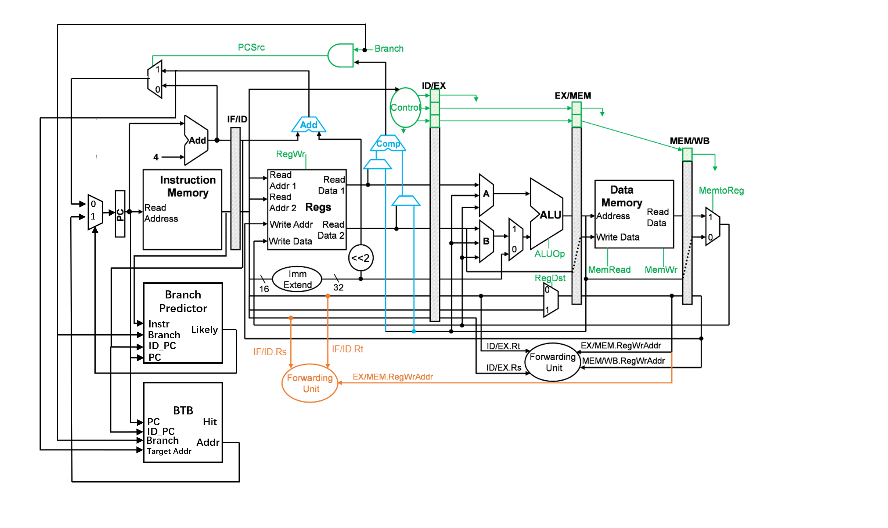

<!--
 * @Descripttion: 
 * @version: 
 * @Author: Mao Shunyu
 * @Date: 2023-08-04 11:11:43
 * @LastEditors: Do not edit
 * @LastEditTime: 2023-08-05 17:18:49
-->
# <center> 流水线MIPS处理器设计 </center>
##### <center>毛顺宇 2021012728</center>
##### <center>2023 年 8 月 5 日</center>

## 1 设计目的

设计一个 5 级流水线的 MIPS 处理器，能够支持数码管、UART外设，并利用此处理器完成最短路径算法
## 2 设计方案
### 2.1 系统框图


### 2.2 设计方案

- 采用`IF - ID - EX - MEM - WB` 五级流水线设计
- 对于`J`型指令在`ID`阶段跳转
- 对于`Load-Use`冒险阻塞一个周期
- 对于条件分支指令采用2Bit计数器分支预测
    - `IF`阶段预解码以进行分支预测
    - 查询`BTB`以获得分支跳转地址
    - `BTB`使用直接相联`32B`容量

## 3 关键代码
### 3.1 文件清单

```lisp
- rtl
    -- tb_CPU_top.v    测试
    -- CPU_top.v       顶层文件
    -- CPU.v           数据通路
    -- Control.v       控制信号
    -- ALUControl.v    ALU控制信号
    -- Forward.v       前递模块
    -- Hazard.v        冒险模块
    -- IF_ID.v         流水线寄存器
    -- ID_EX.v         流水线寄存器
    -- EX_MEM.v        流水线寄存器
    -- MEM_WB.v        流水线寄存器
    -- ALU.v           ALU模块
    -- RegisterFile.v  寄存器文件
    -- BP.v            分支预测器
    -- BTB.v           跳转地址表
    -- MMU.v           内存地址映射
    -- uart_rx.v       串口接收
    -- uart_tx.v       串口发送
- code
    -- Bellman.c       C语言源代码
    -- Bellman.asm     汇编代码
- coe
    -- lab.coe         指令文件
    -- data.coe        数据文件
```
*（修复了验收代码提交中未发现的bug）*

### 3.2 数据通路

### 3.3 冒险模块

### 3.4 前递模块

### 3.5 分支预测器


### 3.6 跳转地址表


## 4 综合情况
### 4.1 资源利用情况


### 4.2 时序情况

## 5 性能分析

## 6 思想体会